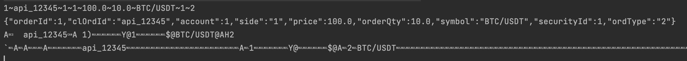

# Message serialization latency measurement

### Content
* [Description](#description)
* [Text Formats](#text-formats)
    * [Custom Test](#custom-test)
    * [Json](#json)
* [Binary Formats](#binary-formats)
    * [ProtoBuf](#protobuf)
    * [SBE](#sbe)
* [Test Results](#test-results)
* [Conclusion](#conclusion)

### Description
It's not a secret that in low-latency systems the message serialization & deserialization takes the most time out of round-trip. Let's be clear, the java code in matching-engine is quite fast, it's message conversion that takes time and both convert object into string and vice versa. And unfortunately we can't skip this step, cause as long as we need to transfer data over network, we have to deal with serialization.
There are 2 types of messages:
* text `XML/JSON/CUSTOM` - here we convert our object into human-readable strings. The big advantage that any human can read raw message and understand it content. The disadvantage in low-latency system, is that it's very slow process.
* binary `SBE/GPB` - here we convert out object into binary data, it's not human-readable, if you try to open such file with any text editor, you will get some gibberish unreadable string. But the main advantage compare to text formats, it's conversion speed. In this project we will take a look into different formats and compare their performance end-to-end.

### Text Formats
##### Custom Test
This is my custom pattern, where we serialize the object into a string with separator. For example order object is serialized into a string where fields goes one-after-another separate by special character. This is example of such string `1~api_12345~1~1~100.0~10.0~BTC/USDT~1~2`. As you see all 9 field of `Order` object are divided by `~`. We serialize object into this string, and deserialize the same way. You can take look into [CustomTextSerializer](/src/main/java/com/exchange/serialization/serializer/CustomTextSerializer.java)

##### Json
This is very standard json serialization, we are using `jackson` library here. You can take a look into [JsonOrderSerializer](/src/main/java/com/exchange/serialization/serializer/JsonOrderSerializer.java)

### Binary Formats
Binary data is faster than text: json parse is very slow, first you parse bytes into text, then you parse text into json object, by comparing values one-by-one character. While in binary either protobuf or SBE, you already has a pre-compiled message structure and when you parse binary, you know where each value from start to end, and quickly parse it => add to document.
Since I can't insert raw data into this file, I can't even paste it here, cause once you insert binary text into readme file, it got broken, and all markup is broken on the web. I'll add a screenshot with 4 strings: custom/json/proto/sbe, so you can see how each looks in textual format. Pay attention that binary data when presented in text format is unreadable. Take a look into this screenshot:


##### Protobuf
GPB - google proto buffer, binary format designed by google, it transform your object into binary form. Since it's binary if you transform it into string you will get some gibberish. You can recognise some part of text like symbol `BTC/USDT`, but overall such string looks like gibberish. So there is no point to present it in string format, only as stream of data or bytes. But you can't just use protobuf. You have to write file with object definition [schema.proto](/src/main/resources/schema.proto), then download compiler and compile this definition into java object. Once you do it, you can start using your object in your code. You can take a look into [ProtobufSerializer](/src/main/java/com/exchange/serialization/serializer/ProtobufSerializer.java) and see that inside we are using object `ProtobufSchema.Order` that was auto-generated. By default this java code won't compile, you need to run below commands first, to generate stubs (java classed from definition file). Then you can compile your code and run tests.
```bash
# first install protobuf compiler
 brew install protobuf
# check version
protoc --version
# generate proto file from definition
protoc -I=src/main/resources --java_out=target/generated-sources schema.proto
```
If you compile it first time, you may need to manually create 2 directories `target/generated-sources`, if they don't exist yet. Once you do this, after compilation, classes would be there under package name defined in definition file. Such classes, although only in `target` folder, would be available to be used in the project. Same goes for SBE.

##### SBE
SBE is faster than other binary formats, since in SBE we first store fixed-sized data like int/long & enums, it's fast-moving reads, and show better performance. You can also take a look into [original article from 2014](https://mechanical-sympathy.blogspot.com/2014/05/simple-binary-encoding.html). SBE very similar to other binary formats, like Protobuf. You need to create file with object definition first [sbe-schema.xml](/src/main/resources/sbe-schema.xml). Then using `sbetool` compile this definition into java class (called stub). Then you can use this class. Below is example how to compile definition into java stub.
```bash
# build your schema manually using following command
# you can download sbe-all from maven repo
java -jar -Dsbe.output.dir=target/generated-sources ~/sbe-all/1.30.0/sbe-all-1.30.0.jar src/main/resources/sbe-schema.xml 
```
Once you compiled your definition you can start using it in your code. Take a look into [SbeOrderSerializer](/src/main/java/com/exchange/serialization/serializer/SbeOrderSerializer.java) for more details how to use SBE generated objects. Again just like with protobuf, by default classes `OrderEncoder/OrderDecoder` won't be there, and this java code won't compile. You have to manually compile your definition into java stubs, then you can compile java project and run the tests.

### Test Results
Below are test results from [JmhPerformanceTest](/src/test/java/com/exchange/serialization/performance/JmhPerformanceTest.java). You can notice following:
* On average binary is order of magnitude faster than text representation
* we run tests in `Mode.Throughput`, but you can run with other options or with all at once `Mode.All`
* In this benchmark it's clear that binary faster, and SBE is way faster then Protobuf
```
Benchmark                                    Mode  Cnt      Score      Error   Units
JmhPerformanceTest.customTextSerialization  thrpt   10   3866.195 ±  767.420  ops/ms
JmhPerformanceTest.jsonSerialization        thrpt   10   1053.249 ±   29.826  ops/ms
JmhPerformanceTest.protobufSerialization    thrpt   10   7977.160 ±  277.715  ops/ms
JmhPerformanceTest.sbeSerialization         thrpt   10  17140.654 ± 3706.266  ops/ms
```

### Conclusion
Time to make some conclusions:
* if you write low-latency system, text-based message format is evil
* use binary for data transfer, don't use text especially json (json is only suitable for web)
* out of all binary, SBE performs the best, so it's winner for low latency systems